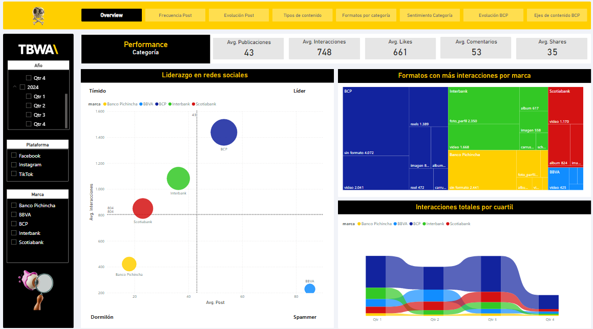
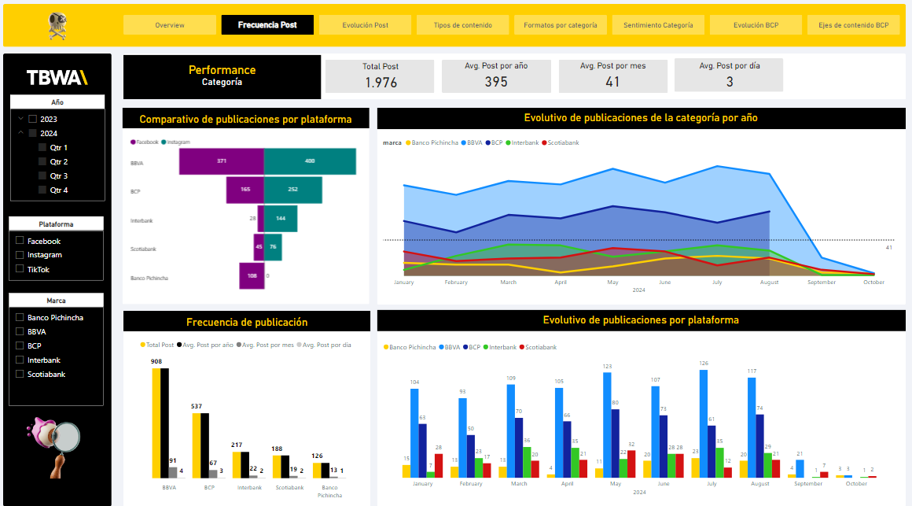
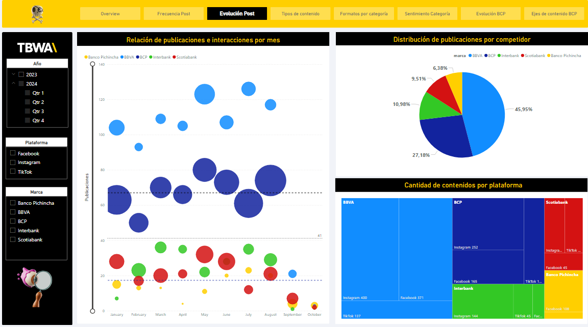
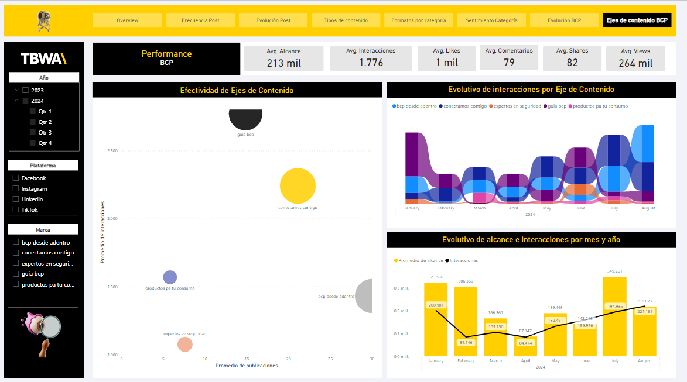

# 📊 Dashboard de Benchmarking de Redes Sociales | Competencia

Este proyecto de Power BI analiza el rendimiento y la estrategia de contenido de competidores clave en redes sociales durante el periodo 2023-2024. El dashboard permite comparar métricas de publicaciones, interacciones y el tipo de contenido más efectivo.

---

## 🎯 Objetivo del Dashboard

Visualizar indicadores clave para entender el posicionamiento de los competidores y optimizar la estrategia de redes sociales:

-   **Rendimiento General:** Comparar publicaciones, interacciones, likes, comentarios y shares entre marcas.
-   **Frecuencia y Evolución:** Analizar la cantidad y el ritmo de publicaciones por plataforma y a lo largo del tiempo.
-   **Tipos de Contenido:** Identificar los formatos y categorías de contenido con mayor interacción.
-   **Análisis de Sentimiento:** Evaluar el sentimiento general de las interacciones.
-   **Ejes de Contenido:** Entender la performance de los diferentes pilares de contenido de cada competidor.

---

## 🧪 Proceso de desarrollo

Este dashboard fue construido a partir de un enfoque completo que incluyó:

### 1. Diseño y Planificación
Se diseñó una interfaz visual clara y dinámica, pensada para la comparación de métricas de redes sociales y la identificación de tendencias clave entre los competidores.

### 2. Preparación y preprocesamiento de datos con Python
-   La información proveniente de diversas fuentes de redes sociales fue procesada y consolidada en una **única tabla** utilizando **Python (Pandas)**.
-   Se unificaron y limpiaron los datos, creando campos categóricos relevantes (como 'red_social', 'tipo_de_contenido', 'marca', etc.).
-   Se gestionaron y eliminaron los valores nulos para asegurar la calidad del dataset.

### 3. Modelado en Power BI
La tabla de datos consolidada fue cargada directamente en Power BI. Para este proyecto, no se implementó un modelo dimensional en estrella, trabajando con una estructura de tabla única optimizada para la visualización.

### 4. Creación de medidas con DAX
-   Se desarrollaron métricas clave para el benchmarking, como promedios de interacción, volumen de publicaciones, likes, shares y comentarios.
-   Se crearon medidas para el análisis evolutivo y la segmentación por tipo de contenido y plataforma.

---

## 🧱 Estructura de Datos

Para este dashboard, toda la información de las redes sociales de los competidores se consolidó en una **única tabla** de datos.

📌 *No se utiliza un modelo relacional en estrella para este dashboard, ya que los datos fueron preprocesados y unificados en una sola tabla.*

---

## 📊 Vistas del Dashboard

El dashboard presenta varias páginas clave para un análisis exhaustivo:

### 1. Overview
Esta página ofrece una visión general del rendimiento de las marcas en redes sociales, mostrando promedios de publicaciones, interacciones, likes, comentarios y shares. Incluye un gráfico de dispersión de liderazgo en redes sociales y un tree map de formatos con más interacciones.

### 2. Frecuencia Post
Esta vista se centra en la frecuencia de las publicaciones por plataforma y marca, mostrando comparativas anuales y mensuales de posts, además de la evolución de publicaciones de la categoría por año.

### 3. Evolución Post
Aquí se analiza la relación de publicaciones e interacciones por mes y la distribución de publicaciones por competidor, permitiendo observar patrones y tendencias en la actividad de los usuarios.

### 4. Ejes de Contenido BCP
Esta página se enfoca en la efectividad de los diferentes ejes o pilares de contenido, mostrando el alcance y las interacciones por eje de contenido, así como su evolución temporal.

---

## 🧠 Medidas DAX

Las medidas DAX utilizadas en este dashboard están orientadas a calcular métricas clave de rendimiento y comparación en redes sociales, como promedios de interacción, volumen de publicaciones, ratios de engagement y análisis de alcance.

---

## 🛠️ Herramientas utilizadas

-   Power BI Desktop
-   Python (Pandas)
-   DAX

---

## 👤 Autor

Gabriel Rodríguez
[LinkedIn](https://www.linkedin.com/in/gabriel-rodr%C3%ADguez-4b4a6216b/)

---
