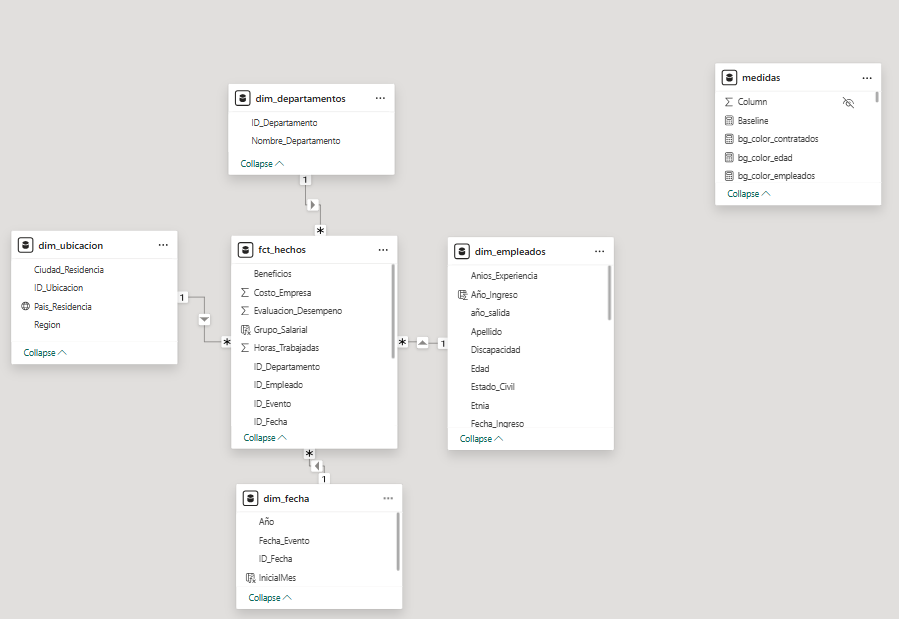
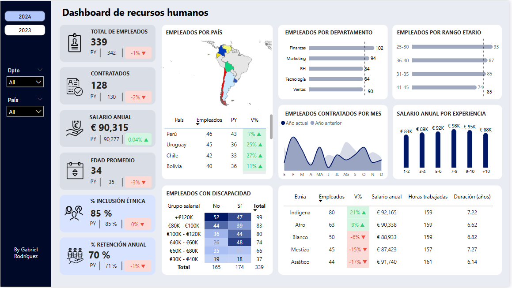
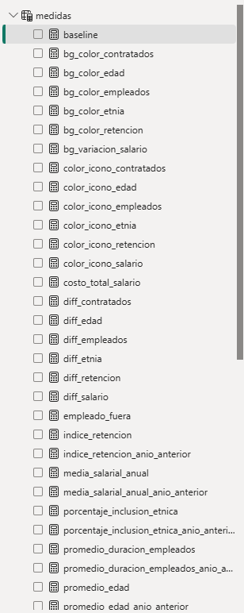

# 📈 Dashboard de Recursos Humanos | Visión 2024

Este proyecto de Power BI ofrece un análisis detallado de los principales indicadores de recursos humanos de una empresa para el año 2024. Permite evaluar la demografía de los empleados, la distribución por país y departamento, el rango salarial, la inclusión étnica y la retención.

---

## 🎯 Objetivo del Dashboard

Visualizar métricas clave para la gestión estratégica de talento y la toma de decisiones en el área de Recursos Humanos:

- **Análisis Demográfico:** Distribución de empleados por edad, país, departamento y etnia.
- **Eficiencia Operativa:** Salario promedio, horas trabajadas y duración promedio de empleo.
- **Diversidad e Inclusión:** Porcentaje de inclusión étnica y empleados con discapacidad.
- **Retención de Talento:** Tasa de retención anual y análisis de contrataciones.
- **Análisis Temporal:** Monitoreo de métricas clave a lo largo del año.

---

## 🧪 Proceso de desarrollo

Este dashboard fue construido a partir de un enfoque completo que incluyó:

### 1. Diseño y Planificación
Se planteó una interfaz visual clara y jerarquizada, orientada a ofrecer una visión integral y comparativa de los datos de RRHH.

### 2. Estructuración de la fuente de datos
La información original fue transformada y organizada en un **modelo dimensional en estrella**, separando las dimensiones (empleados, departamentos, ubicación, fecha) de la tabla de hechos, para asegurar la eficiencia del análisis.

### 3. Preparación y limpieza de datos
- Uso de **Power Query** para la transformación, limpieza y estandarización de los datos.
- Manejo de valores nulos, formatos de fecha uniformes y tipologías consistentes.
- Generación de claves y separación semántica de las entidades de RRHH.

### 4. Modelado relacional en Power BI
Se establecieron relaciones eficientes entre las tablas del modelo dimensional, priorizando la claridad y el rendimiento para facilitar la creación de medidas y visualizaciones precisas.

### 5. Creación de medidas con DAX
- Se desarrollaron métricas clave para el análisis de personal, incluyendo totales de empleados, salarios, promedios y porcentajes de variación.
- Se implementaron medidas para el cálculo de indicadores de diversidad y retención.

---

## 🧱 Modelo Dimensional

Este dashboard está basado en un modelo estrella con las siguientes tablas:

**Tabla de hechos:**
- `fct_hechos`: contiene datos como costo/beneficio de la empresa, evaluación de desempeño, grupo salarial, horas trabajadas, eventos y fechas.

**Dimensiones:**
- `dim_departamentos`
- `dim_ubicacion`
- `dim_empleados`
- `dim_fecha`

📌 *Modelo relacional ilustrado:*


---

## 📊 Vistas del Dashboard

El dashboard presenta una vista principal para el análisis del año actual:

### 1. Overview 
Esta página muestra un resumen de los indicadores de recursos humanos, incluyendo el total de empleados, contratados, salario anual promedio, edad promedio, distribución por país, departamento, rango etario, empleados con discapacidad y porcentaje de inclusión étnica y retención.



---

## 🧠 Medidas DAX

Entre las medidas DAX utilizadas para los cálculos del dashboard, destacan:

-   `total_empleados_activos =`
    ```dax
    COUNTROWS(
        FILTER(
            SUMMARIZE(
                fct_hechos,
                fct_hechos[ID_Empleado],
                "EsActivo", LOOKUPVALUE(
                    dim_empleados[Motivo_Salida],
                    dim_empleados[ID_Empleado], fct_hechos[ID_Empleado]
                )
            ),
            [EsActivo] = "Activo"
        )
    )
    ```
-   `total_empleados_contratados =`
    ```dax
    CALCULATE(
        COUNTROWS('fct_hechos'),
        'fct_hechos'[Tipo_Evento] = "Contratación",
        VALUES('Dim_Fecha'[Año])
    )
    ```
-   `total_salarios = SUM('fct_hechos'[Salario])`
-   `indice_retencion =`
    ```dax
    VAR Anio = SELECTEDVALUE('Dim_Fecha'[Año])
    VAR EmpleadosInicio =
        CALCULATE(
            COUNTROWS('Dim_Empleados'),
            'Dim_Empleados'[Fecha_Ingreso] <= DATE(Anio, 1, 1)
        )
    VAR EmpleadosFin =
        CALCULATE(
            COUNTROWS('Dim_Empleados'),
            'Dim_Empleados'[Fecha_Ingreso] <= DATE(Anio, 1, 1),
            OR(ISBLANK('Dim_Empleados'[Fecha_Salida]), 'Dim_Empleados'[Fecha_Salida] > DATE(Anio, 12, 31))
        )
    RETURN
    DIVIDE(EmpleadosFin, EmpleadosInicio, 0)
    ```
-   `porcentaje_inclusion_etnica =`
    ```dax
    VAR Anio = SELECTEDVALUE('Dim_Fecha'[Año])
    VAR EmpleadosActivos =
        CALCULATETABLE(
            'Dim_Empleados',
            'Dim_Empleados'[Fecha_Ingreso] <= DATE(Anio, 12, 31),
            OR(
                ISBLANK('Dim_Empleados'[Fecha_Salida]),
                'Dim_Empleados'[Fecha_Salida] > DATE(Anio, 12, 31)
            )
        )
    VAR Total = COUNTROWS(EmpleadosActivos)
    VAR Minorias =
        CALCULATE(
            COUNTROWS('Dim_Empleados'),
            KEEPFILTERS(EmpleadosActivos),
            'Dim_Empleados'[Etnia] <> "Blanco"
        )
    RETURN
    DIVIDE(Minorias, Total, 0)```

📌 *Captura de medidas en Power BI:*


---

## 🧩 Conclusiones

Basado en las visualizaciones del dashboard, se pueden extraer las siguientes conclusiones:

- La cantidad de empleados se mantuvo estable en 2024.
- El salario anual promedio tuvo un leve aumento.
- Perú, Uruguay y Chile concentran la mayor parte del personal.
- Finanzas y Marketing son los departamentos con más colaboradores.
- La mayoría del equipo tiene entre 25 y 40 años.
- La retención anual fue del 70%, con espacio para mejorar.
- La inclusión étnica supera el 80%, sin cambios frente a 2023.

---

## 🛠️ Herramientas utilizadas

- Power BI Desktop
- Power Query
- DAX

---

## 👤 Autor

Gabriel Rodríguez
[LinkedIn](https://www.linkedin.com/in/gabriel-rodr%C3%ADguez-4b4a6216b/)

---
