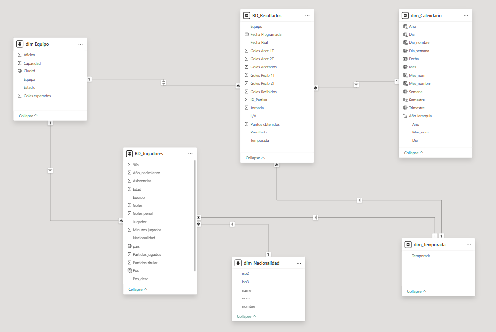
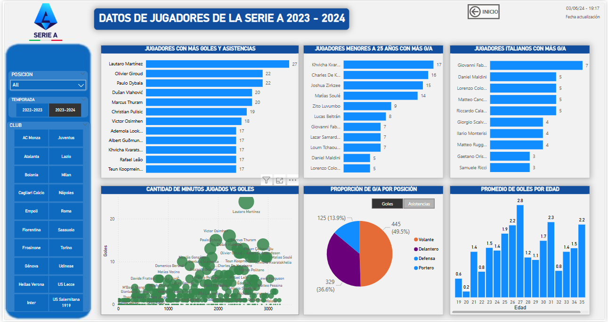
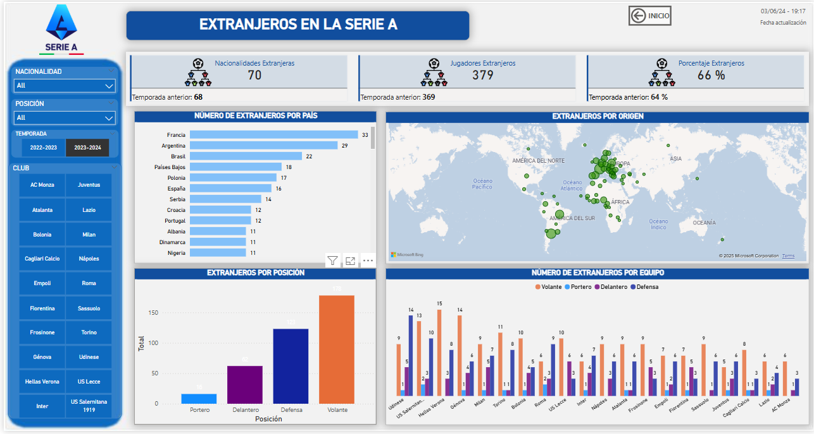
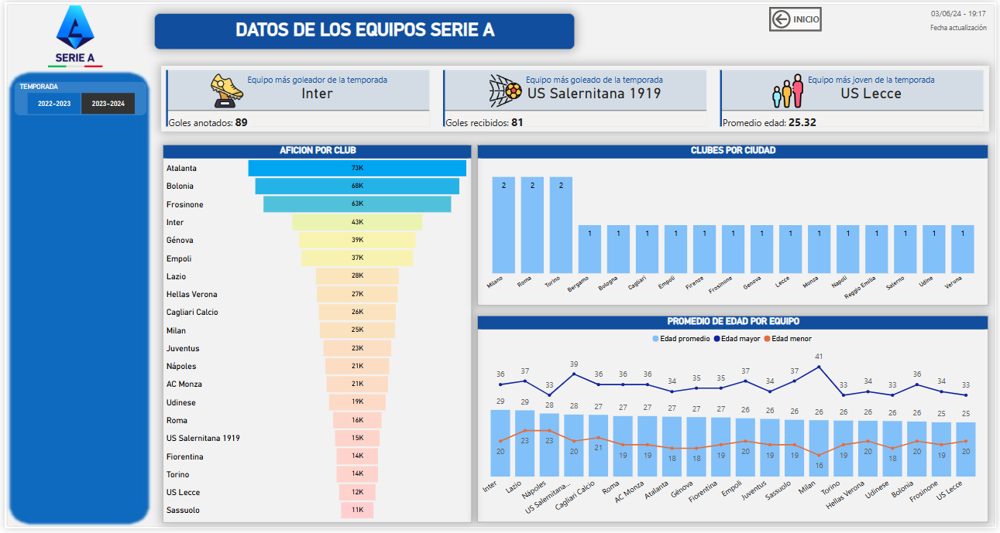
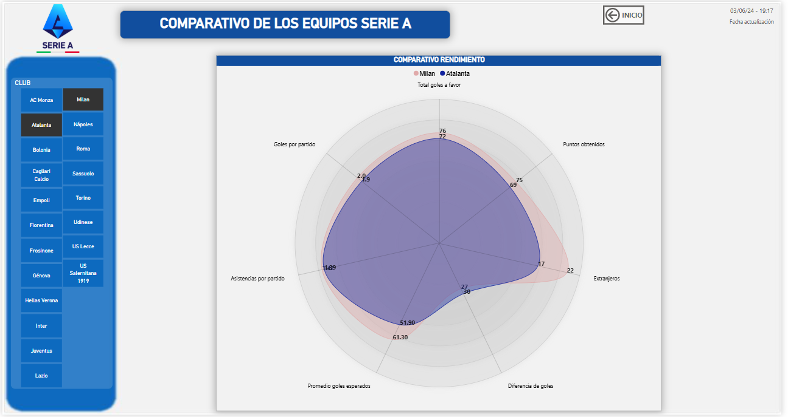
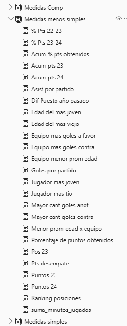

# ⚽ Análisis de la Serie A 2023-2024 | Fútbol Italiano

Este proyecto de Power BI presenta un análisis de la temporada 2023-2024 de la Serie A. La particularidad de este proyecto reside en la **extracción de datos mediante web scraping** de la plataforma **fbref.com**, para luego transformarlos y visualizarlos en un dashboard interactivo.

---

## 🎯 Objetivo del Informe

-   **Analizar el rendimiento de los equipos:** Evaluar métricas clave de ataque, defensa y desempeño general.
-   **Identificar tendencias:** Observar patrones de juego y eficacia a lo largo de la temporada.
-   **Comparar equipos:** Posicionar a los clubes según diferentes indicadores estadísticos.
-   **Visualizar datos complejos:** Presentar estadísticas de fútbol de manera clara y comprensible.
-   **Demostrar habilidades de scraping:** Mostrar el proceso de obtención de datos directamente de la web.

---

## 🧪 Proceso de Desarrollo

Este informe fue construido siguiendo un pipeline de datos que incluye:

### 1. Web Scraping con Python
-   **Extracción de Datos:** Se utilizó **Python** para realizar web scraping directamente desde **fbref.com**.
-   **Recolección de Métricas:** Se obtuvieron estadísticas detalladas de equipos para la temporada 2023-2024, incluyendo goles, goles esperados (xG), posesión, tiros, pases, y métricas defensivas.

### 2. Preparación y Transformación de Datos (ETL)
-   **Limpieza de Datos:** Procesamiento de los datos scrapeados para manejar valores nulos, formatos inconsistentes y tipos de datos.
-   **Transformación:** Adecuación de las tablas para el análisis, creando columnas calculadas si fue necesario.

### 3. Modelado de Datos en Power BI
-   **Estructura del Modelo:** Los datos se organizaron en un **modelo dimensional en estrella** para optimizar el rendimiento y la flexibilidad del análisis.
-   **Relaciones:** Se establecieron las relaciones adecuadas entre las tablas de hechos y dimensiones.

### 4. Creación de Medidas con DAX
-   Se desarrollaron medidas DAX personalizadas para calcular métricas de rendimiento específicas del fútbol, como promedios por 90 minutos, ratios de eficiencia y comparativas.

### 5. Diseño y Visualización del Dashboard
-   Se diseñaron múltiples páginas para presentar diferentes perspectivas del análisis, utilizando gráficos y tablas intuitivos para comunicar los insights de manera efectiva.

---

## 🧱 Modelo Dimensional

El dashboard está basado en un modelo estrella para una eficiente gestión de los datos futbolísticos:

**Tabla de hechos:**
-   `fct_stats_equipo`: Contiene las métricas numéricas de cada partido/equipo (goles, xG, tiros, pases, etc.).

**Dimensiones (ejemplos, adaptado a los datos de fbref):**
-   `dim_equipos`: Nombres de los equipos.
-   `dim_calendario`: Información de fecha y jornada.
-   `dim_partidos`: Detalles únicos de cada encuentro.

📌 *Modelo relacional ilustrado:*

---

## 📊 Vistas del Dashboard

El informe presenta varias páginas dedicadas a diferentes aspectos del análisis de la Serie A:

### 1. Overview y Posicionamiento General
Esta página ofrece una visión general del rendimiento de los equipos, incluyendo tablas de clasificación y métricas clave como goles marcados, goles esperados (xG), puntos y diferencia de goles.

### 2. Análisis Ofensivo
Detalle de las métricas de ataque, como tiros totales, tiros a puerta, goles por partido y eficiencia ofensiva de los equipos.

### 3. Análisis Defensivo
Exploración de las métricas defensivas, incluyendo goles recibidos, goles esperados en contra (xGA), porcentaje de posesión y otras estadísticas de contención.

### 4. Rendimiento por Partido / Comparativa Detallada
Esta sección permite comparar el rendimiento de equipos específicos o analizar métricas en detalle por partido.

### 5. Desempeño de Jugadores Clave (o Frecuencia/Tendencias)
*(Descripción si esta página muestra rendimiento de jugadores top o tendencias específicas, ya que el `png_5` es un gráfico de área que podría indicar evolución o distribución)*

---

## 🧠 Medidas DAX

Las medidas DAX utilizadas en este dashboard son fundamentales para calcular y agregar las estadísticas futbolísticas, permitiendo un análisis dinámico y preciso. Incluyen cálculos de promedios, ratios de conversión y comparativas entre equipos.

📌 *Captura de medidas en Power BI:*

---

## 🛠️ Herramientas Utilizadas

-   **Python:** Para Web Scraping.
-   **Power BI Desktop:** Para modelado de datos, creación de medidas DAX y visualización del dashboard.
-   **Power Query:** Para la preparación y transformación de datos dentro de Power BI.
-   **DAX:** Para cálculos y lógica de negocio.

---

## 👤 Autor

Gabriel Rodríguez
[LinkedIn](https://www.linkedin.com/in/gabriel-rodr%C3%ADguez-4b4a6216b/)

---
