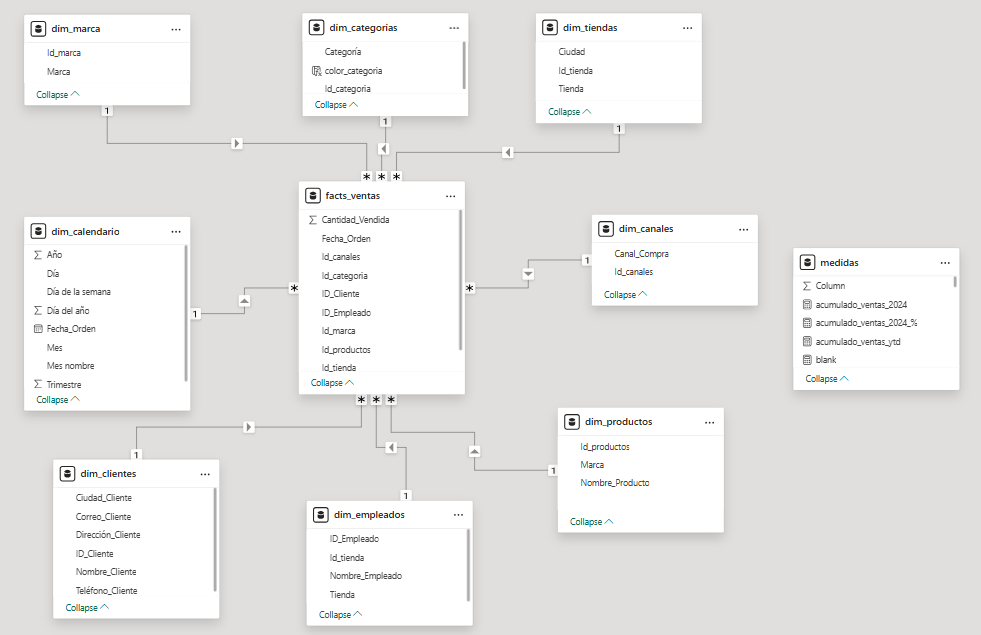
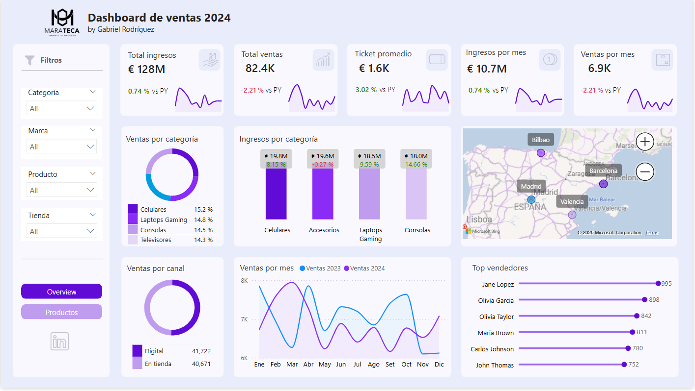
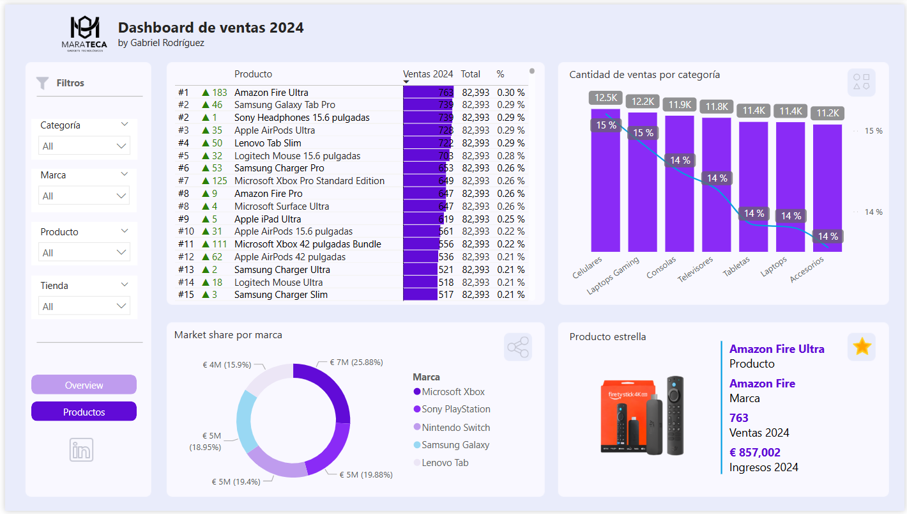
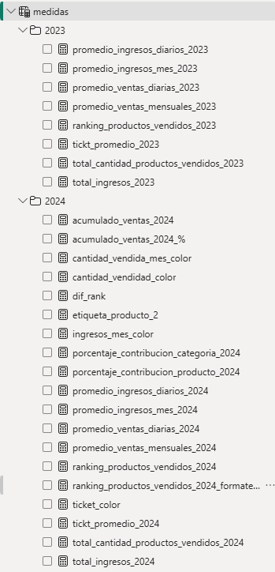

# 🛍️ Dashboard de Ventas 2024 | Tienda Digital Marateca

Este proyecto de Power BI analiza las ventas de una tienda digital en España durante el periodo 2023-2024, ofreciendo una visión completa del rendimiento por categorías, productos, canales de venta y vendedores.

---

## 🎯 Objetivo del Dashboard

Visualizar indicadores clave para la toma de decisiones comerciales y estratégicas:

- Rendimiento de ventas por categoría y producto.
- Análisis de ingresos y ventas por canal (digital vs. tienda física).
- Identificación de los productos estrella y los top vendedores.
- Comparativa de ventas e ingresos entre 2023 y 2024.

---

## 🧪 Proceso de desarrollo

Este dashboard fue construido a partir de un enfoque completo que incluyó:

### 1. Diseño personalizado
Se planteó una interfaz visual clara y jerarquizada, optimizada para la visualización de métricas de ventas y productos.

### 2. Estructuración de la fuente de datos
La información original fue transformada y estructurada para construir un **modelo dimensional en estrella**, separando dimensiones y métricas en tablas específicas para un análisis eficiente.

### 3. Preparación y limpieza de datos
- Uso de **Power Query** para transformar columnas, eliminar errores y generar claves.
- Formatos unificados y tipologías estandarizadas.
- Separación semántica entre entidades (productos, categorías, tiendas, clientes, etc.).

### 4. Modelado relacional en Power BI
Se crearon relaciones optimizadas entre las tablas, priorizando el rendimiento y la claridad del modelo para asegurar la integridad de los datos y facilitar los cálculos.

### 5. Creación de medidas con DAX
- Se calcularon métricas clave como ingresos, ventas y KPIs por año.
- Se incluyeron comparaciones anuales y porcentajes de variación.
- Se modelaron medidas dinámicas y segmentadas por diversas dimensiones como categorías y productos.

---

## 🧱 Modelo Dimensional

Este dashboard está basado en un modelo estrella con las siguientes tablas:

**Tabla de hechos:**
- `facts_ventas`: contiene la cantidad vendida, ingresos, etc.

**Dimensiones:**
- `dim_marca`
- `dim_categorias`
- `dim_tiendas`
- `dim_calendario`
- `dim_canales`
- `dim_productos`
- `dim_clientes`
- `dim_empleados`

📌 *Modelo relacional ilustrado:*

---

## 📊 Vistas del Dashboard

### 1. Overview
Esta página ofrece un resumen general de las ventas e ingresos de la tienda digital, incluyendo métricas clave como el total de ingresos, ventas, ticket promedio e ingresos/ventas por mes. También presenta un desglose por categoría, ventas por canal y los top vendedores.

### 2. Productos
Esta página se enfoca en el rendimiento detallado de los productos, mostrando un ranking de los productos más vendidos, la cantidad de ventas por categoría y destacando el producto estrella con sus métricas principales.

---

## 🧠 Medidas DAX

Entre las medidas DAX utilizadas para los cálculos del dashboard, destacan:

- `total_ingresos_2024 = CALCULATE( SUMX(facts_ventas, facts_ventas[cantidad_vendida] * facts_ventas[Precio]), YEAR(facts_ventas[Fecha_Orden]) = 2024 )`
- `total_cantidad_productos_vendidos_2024 = CALCULATE( SUM(facts_ventas[cantidad_vendida]), YEAR(facts_ventas[Fecha_Orden]) = 2024 )`
- `tickt_promedio_2024 = DIVIDE( [total_ingresos_2024], [total_cantidad_productos_vendidos_2024], 0 )`
- `porcentaje_contribucion_producto_2024 = DIVIDE( [total_ventas_por_producto_2024], CALCULATE( SUM(facts_ventas[cantidad_vendida]), ALL(facts_ventas) ), 0 )`

📌 *Captura de medidas en Power BI:*

---

## 🧩 Conclusiones

Basado en las visualizaciones del dashboard, se pueden extraer las siguientes conclusiones iniciales:

- Los celulares y accesorios fueron las categorías con más ingresos en 2024 (>19M).
- La cantidad de ventas por canal fue equilibrada entre el digital (51%) y la tienda física (49%).
- Amazon Fire Ultra fue el producto más vendido de 2024.
- Barcelona y Valencia generaron más ventas en el 2024, con 22 mil y 20 mil, respectivamente.
- Jane Lopez fue la vendedora con el mayor volumen de ventas (+900).

---

## 🛠️ Herramientas utilizadas

- Power BI Desktop
- Power Query
- DAX

---

## 👤 Autor

Gabriel Rodríguez
[LinkedIn](https://www.linkedin.com/in/gabriel-rodr%C3%ADguez-4b4a6216b/)

---
