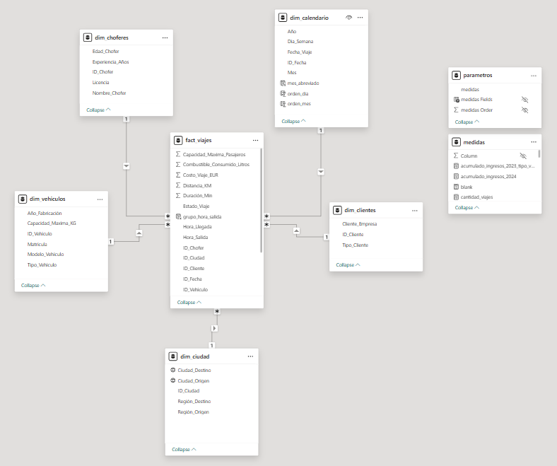
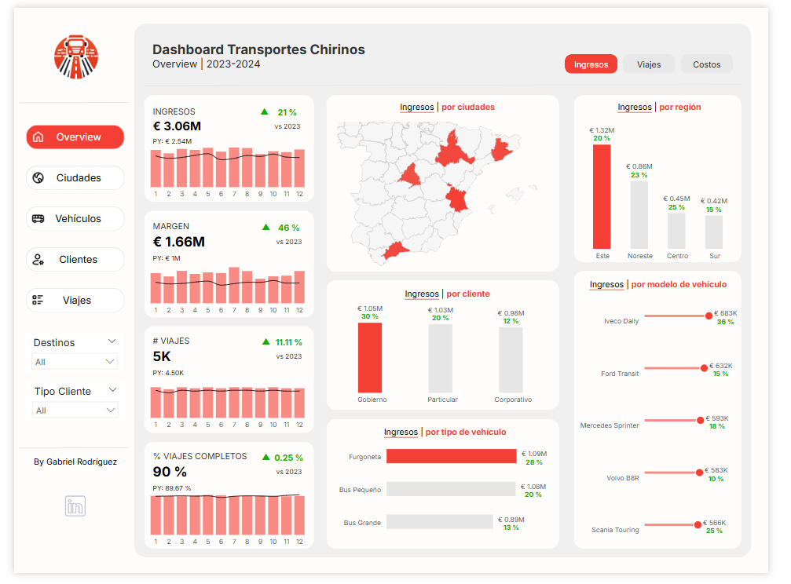
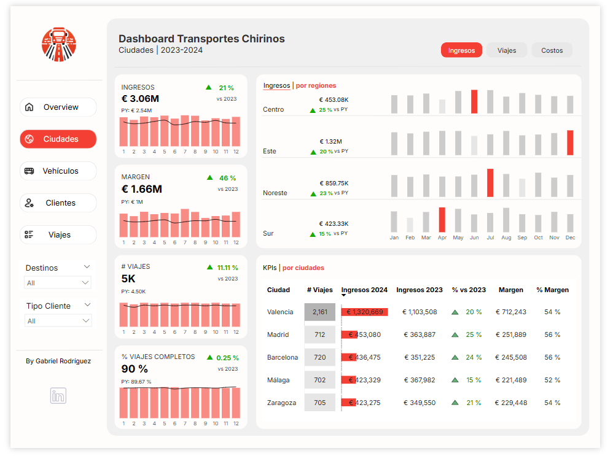
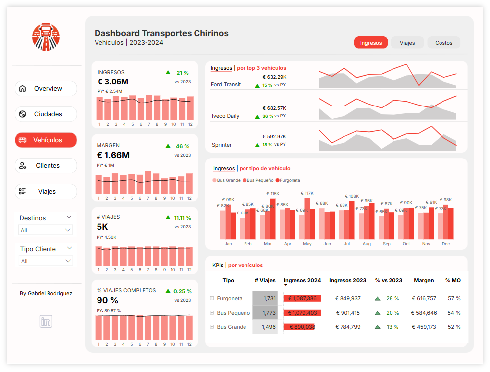
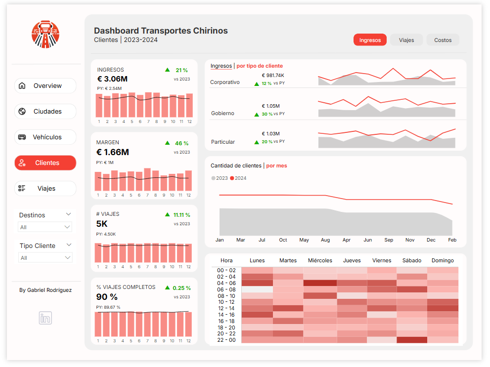
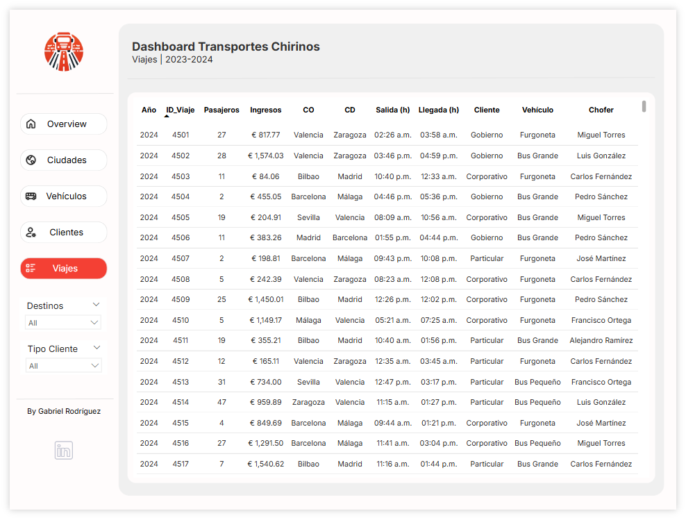
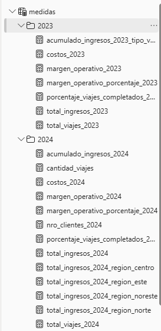

# 🚚 Dashboard de Transporte | Transportes Chirinos

Este proyecto de Power BI analiza los ingresos, margen y eficiencia de viajes de una empresa de transporte en España durante el periodo 2023-2024.

---

## 🎯 Objetivo del Dashboard

Visualizar indicadores clave para la toma de decisiones operativas y comerciales:

- Ingresos y márgenes por región, ciudad, tipo de vehículo y cliente
- Rendimiento de viajes por volumen e ingresos
- Análisis temporal

---

## 🧱 Modelo Dimensional

Este dashboard está basado en un modelo estrella con las siguientes tablas:

**Tabla de hechos:**
- `fact_viajes`: contiene ingresos, costos, márgenes, fechas y vehículos

**Dimensiones:**
- `dim_clientes`
- `dim_ciudad`
- `dim_choferes`
- `dim_vehiculos`
- `dim_calendario`

📌 *Modelo relacional ilustrado:*

---

## 📊 Vistas del Dashboard

### 1. Overview

### 2. Ciudades

### 3. Vehículos

### 3. Clientes

### 3. Viajes

---

## 🧠 Medidas DAX

Entre las medidas DAX utilizadas destacan:

- `total_viajes_2024 = CALCULATE(COUNT(fact_viajes[id_viaje]), TREATAS( {2024}, dim_calendario[Año]))`
- `margen_operativo_2024 = [total_ingresos_2024] - [costos_2024]`
- `margen_operativo_porcentaje_2024 = DIVIDE( [margen_operativo_2024], [total_ingresos_2024], 0)`
- `porcentaje_viajes_completados_2024 = DIVIDE(CALCULATE(COUNTROWS(fact_viajes), fact_viajes[estado_viaje] = "Completado",TREATAS( {2024}, dim_calendario[Año])), [total_viajes_2024],0)`

📌 *Captura de medidas en Power BI:*

---

## 🧩 Conclusiones

- La región Este genera el mayor volumen de ingresos, seguida por el Noreste.
- El cliente Gobierno representa el mayor ingreso individual.
- El modelo Iveco Daily es el más rentable por volumen.
- La puntualidad en los viajes se mantiene alta (>90%).
- Valencia es la ciudad con más viajes y más ingresos en 2024.
- En 2023 y 2024 agosto fue el mes con más clientes promediando 400 en total.

---

## 🛠️ Herramientas utilizadas

- Power BI Desktop
- Power Query
- DAX
- Visualizaciones personalizadas (mapas, heatmaps, barras combinadas)

---

## 👤 Autor

Gabriel Rodríguez  
[LinkedIn](https://www.linkedin.com/in/gabriel-rodr%C3%ADguez-4b4a6216b/)

---
