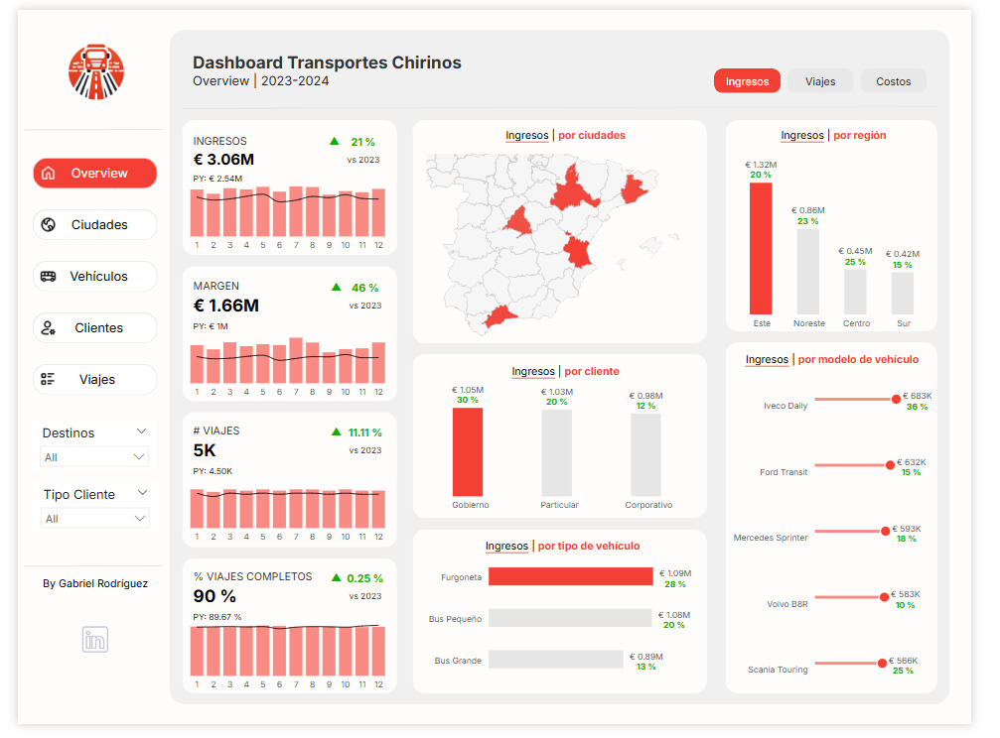
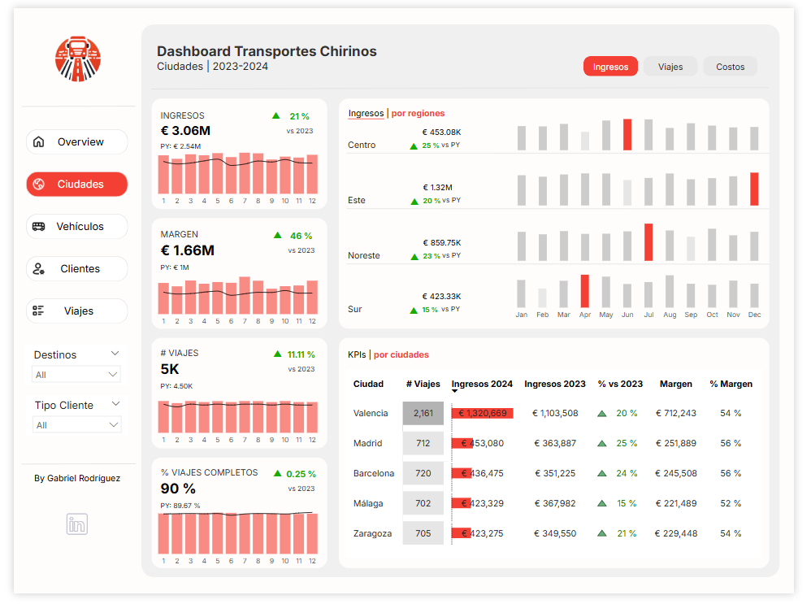
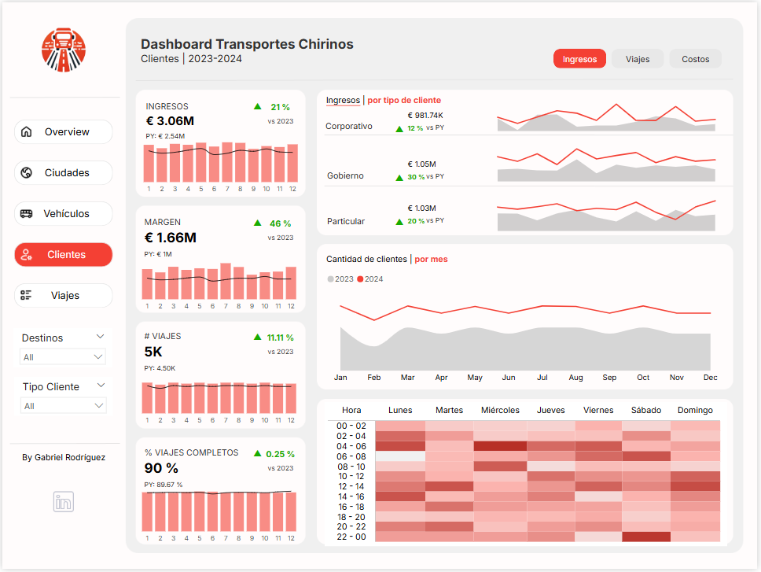

# 🚚 Dashboard de Transporte | Transportes Chirinos

Este proyecto de Power BI analiza los ingresos, margen y eficiencia de viajes de una empresa de transporte en España durante el periodo 2023-2024.

---

## 🎯 Objetivo del Dashboard

Visualizar indicadores clave para la toma de decisiones operativas y comerciales:

- Ingresos y márgenes por región, ciudad, tipo de vehículo y cliente
- Rendimiento de viajes por volumen y puntualidad
- Análisis temporal por meses, días y horas

---

## 🧱 Modelo Dimensional

Este dashboard está basado en un modelo estrella con las siguientes tablas:

**Tabla de hechos:**
- `F_Viajes`: contiene ingresos, costos, márgenes, fechas y vehículos

**Dimensiones:**
- `D_Cliente`
- `D_Ciudad`
- `D_Tiempo`
- `D_Vehículo`
- `D_TipoCliente`

📌 *Modelo relacional ilustrado:*

---

## 📊 Vistas del Dashboard

### 1. Overview

### 2. Ciudades

### 3. Clientes

---

## 🧠 Medidas DAX

Entre las medidas DAX utilizadas destacan:

- `Total Ingresos = SUM(F_Viajes[Ingresos])`
- `Margen (%) = DIVIDE(F_Viajes[Margen], F_Viajes[Ingresos])`
- `% Viajes Completos = DIVIDE(ViajesCompletos, TotalViajes)`
- `Crecimiento Interanual = DIVIDE(Actual - Anterior, Anterior)`

📌 *Captura de medidas en Power BI:*

---

## 🧩 Conclusiones

- La región Este genera el mayor volumen de ingresos, seguida por el Noreste.
- El cliente "Gobierno" representa el mayor ingreso individual.
- El modelo Iveco Daily es el más rentable por volumen.
- La puntualidad en los viajes se mantiene alta (>90%).

---

## 🛠️ Herramientas utilizadas

- Power BI Desktop
- Power Query
- DAX
- Visualizaciones personalizadas (mapas, heatmaps, barras combinadas)

---

## 👤 Autor

Gabriel Rodríguez  
[LinkedIn](https://www.linkedin.com/in/tu-linkedin/) *(puedes editar esto)*

---
