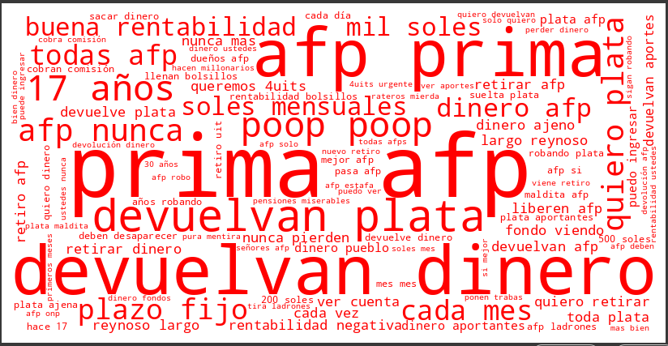
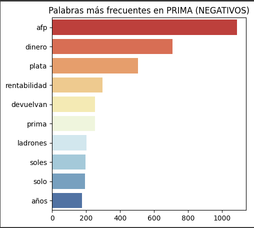
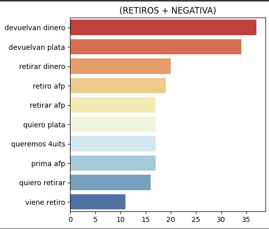

# ✍️ Análisis de Texto y N-gramas | Marca Prima

Este proyecto de análisis de texto en Python se enfoca en desentrañar los insights clave de las conversaciones en torno a la marca **Prima** a través del procesamiento de lenguaje natural (NLP). El objetivo es identificar los temas y las asociaciones más frecuentes en los comentarios y mensajes alojados en redes sociales, prestando especial atención a los **bigramas** y el **sentimiento**.

---

## 🎯 Objetivo del Proyecto

-   **Descubrir insights:** Identificar los temas y las palabras/frases más relevantes en los datos textuales relacionados con la marca Prima.
-   **Análisis de sentimiento:** Explorar el sentimiento asociado a los comentarios, con un enfoque particular en el análisis de bigramas en textos negativos.
-   **Visualización de datos:** Utilizar nubes de palabras para representar visualmente la frecuencia de los bigramas y las asociaciones de términos.
-   **Validación de hipótesis:** Apoyar la toma de decisiones basada en datos cualitativos, complementando análisis cuantitativos.

---

## 🧪 Proceso de Desarrollo

Este proyecto sigue un flujo de trabajo estructurado para el análisis de texto:

### 1. Carga y Filtrado del Dataset
-   Carga de un dataset consolidado (`bbdd_consolidado_prima - quantico_sentimiento_prima.csv`).
-   Filtrado inicial para eliminar mensajes nulos y asegurar la consistencia de los IDs y formatos de fecha/hora.
-   Limpieza de caracteres especiales/codificación para un procesamiento correcto de los textos.

### 2. Preparación de Datos Textuales
-   Extracción de mensajes textuales relevantes, específicamente aquellos asociados a un sentimiento 'Negativo' para un análisis más profundo.
-   Obtención y aplicación de **stopwords en español** de la librería NLTK para eliminar palabras comunes que no aportan valor al análisis de frecuencia.

### 3. Análisis de N-gramas (Bigramas)
-   Utilización de `CountVectorizer` de Scikit-learn para extraer **bigramas (pares de palabras)** de los textos.
-   Cálculo de la frecuencia de aparición de cada bigrama.

### 4. Visualización con Nubes de Palabras (WordCloud)
-   Generación de nubes de palabras para representar la frecuencia de los bigramas.
-   Implementación de una función de color personalizada para resaltar los bigramas más frecuentes, permitiendo una identificación visual rápida de los temas dominantes en el sentimiento negativo.

---

## 🧱 Estructura del Dataset (Referencia)

El análisis se basa en un dataset que, según el código, contiene información de mensajes y su sentimiento asociado, entre otras columnas. Las columnas clave para este análisis son:

-   `mensaje`: Contiene el texto de los comentarios o interacciones.
-   `valoracion`: Indica el sentimiento asociado al mensaje (ej. 'Positiva', 'Negativa', 'Neutra').
-   `fecha`: Fecha de la interacción.
-   `hora`: Hora de la interacción.

📌 *Dado que el análisis se centra en un dataset específico y un proceso de script, no hay un "Modelo Dimensional" en el sentido de un dashboard de Power BI.*

---

## 📊 Resultados y Visualizaciones

A continuación, se presentan algunas de las visualizaciones generadas como parte de este análisis:

### Nube de Palabras de Bigramas Negativos
Esta visualización resalta los pares de palabras más frecuentes en los mensajes con valoración negativa, con un esquema de colores que indica su frecuencia (rojo para más frecuente, amarillo para menos).

### Distribución de Sentimiento

### Distribución de menciones por red social a lo largo de los meses

### Frecuencia de Palabras Negativas

### Frecuencia de Palabras Negativas (bigrama)

### Frecuencia de Palabras Negativas sobre Retiros de AFP (bigrama)

---

## 🧠 Insights y Conclusiones

Basado en el análisis de n-gramas, se pueden extraer conclusiones como:

-   Para el sentimiento negativo hay una gran predominancia de palabras referentes a rentabilidad y a los 17 años de Prima liderando (ejemplo: "17 años robando mi plata... sinvergüenzas" o "17 años enriqueciendo con la plata de los aportes"). Se sugiere tomar acción para cambiar la percepción de enriquecimiento a costa de los clientes que tiene la marca.
-   Para el sentimiento neutro la combinación de palabras más frecuentes corresponde a solicitudes de información. Así como buena recepción de contenido de seguridad ("gracias") con la participación de Stephen Jika y Lovina Stephen.
-   De las categorías tagueadas:
    * El 17% corresponde a Campañas en su mayoría de traspasos, donde el sentimiento negativo se ve muy concentrado en torno a los 17 años de prima liderando y cuenta con alta presencia de comentarios de poop (💩) además de resumirse en "17 años robando".
    * El 11% corresponde a Aportes y fondos, donde el sentimiento negativo concentra combinaciones de palabras referentes a que "la rentabilidad en realidad es negativa".
    * El 7% corresponde a Retiros, donde la negatividad está centrada en la devolución de dinero y que "la afp no libera las 4 UIT's que tocan por ley".
-   Entre las palabras frecuentes, se destacó la combinación "plazo fijo", donde los usuarios mencionaron su preferencia por retirar dinero de la AFP y depositarlo en un plazo fijo. Esto sugiere la oportunidad de trabajar con productos similares o reforzar la confianza que genera un Fondo de Pensiones en comparación con un producto como el plazo fijo.

---

## 🛠️ Herramientas Utilizadas

-   **Python:** Lenguaje de programación principal.
-   **Pandas:** Para manipulación y limpieza de datos.
-   **NLTK:** Para procesamiento de lenguaje natural (stopwords).
-   **Scikit-learn:** Para la vectorización y extracción de n-gramas (`CountVectorizer`).
-   **WordCloud:** Para la generación de nubes de palabras.
-   **Matplotlib, Seaborn:** Para visualización de datos.

---

## 📄 Archivos del Proyecto

-   `text_analysis.py`: (https://github.com/Jazsemgabriel/portafolio-dashboards/blob/main/python-text-analysis/paginas/text_analysis.py)
---

## 👤 Autor

Gabriel Rodríguez
[LinkedIn](https://www.linkedin.com/in/gabriel-rodr%C3%ADguez-4b4a6216b/)

---
